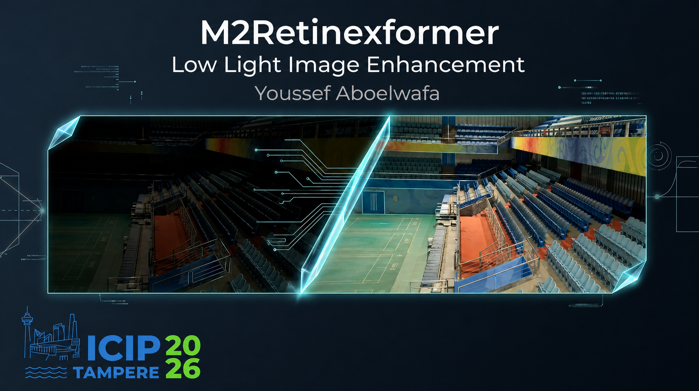
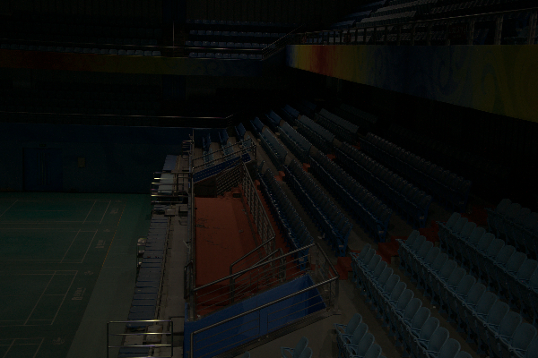
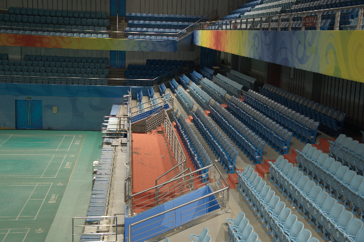
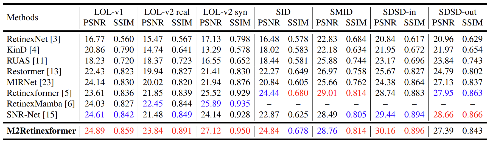
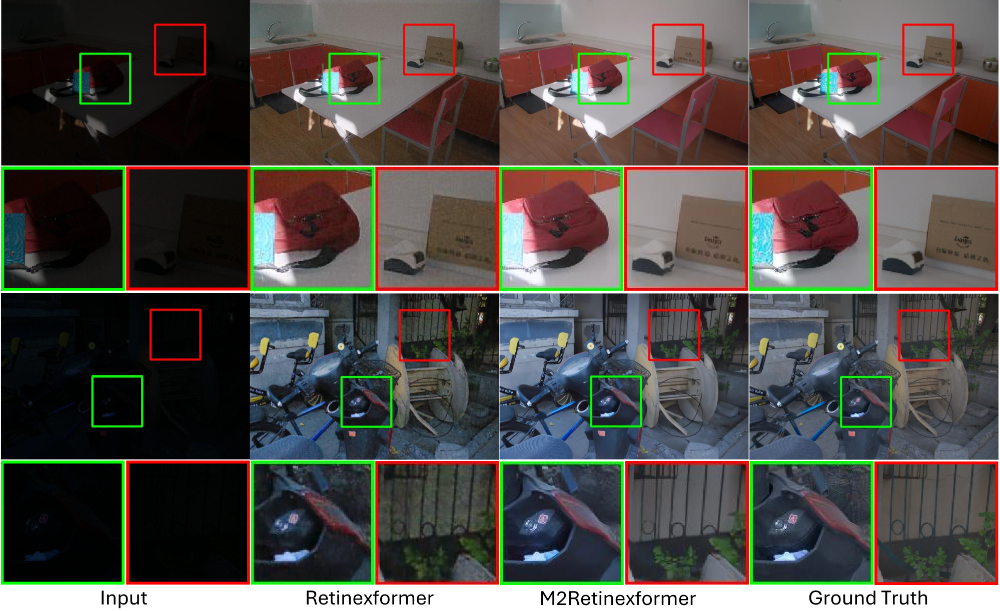
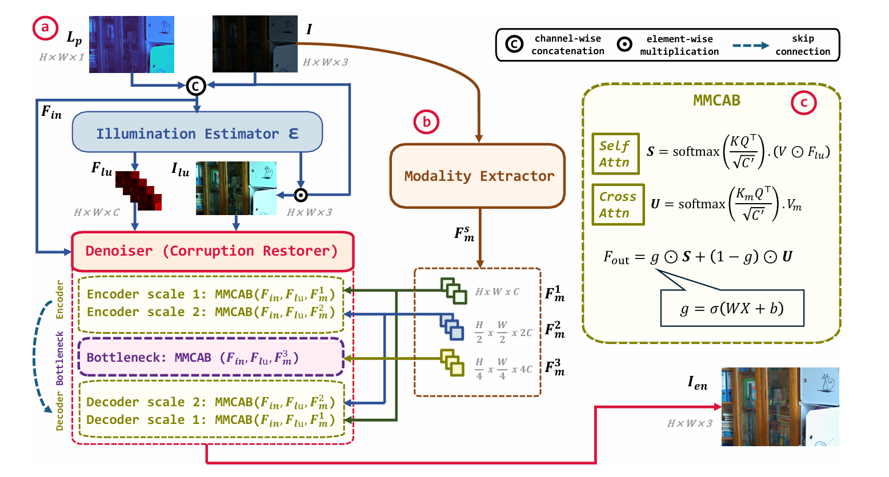

<div align="center">

</div>

<br>

<div align="center">

[](#citation)
[](https://github.com/YoussefAboelwafa/M2Retinexformer)
[](#m2retinexformer-pretrained-weights)

</div>

## Introduction

Low-light image enhancement is challenging due to complex degradations, including amplified noise, artifacts, and color distortion. While Retinex-based deep learning methods have achieved promising results, they primarily rely on single-modality RGB information. 

We propose **M2Retinexformer** (Multi-Modal Retinexformer), a novel framework that extends **[Retinexformer](https://arxiv.org/abs/2303.06705)** by incorporating _depth cues_, _luminance priors_, and _semantic features_ within a progressive refinement pipeline. 

Depth provides geometric context that is invariant to lighting variations, while luminance and semantic features offer explicit guidance on brightness distribution and scene understanding. 
Modalities are extracted at multiple scales and fused through _cross-attention_, with _adaptive gating_ playing a critical role in regulating the contribution of each modality when multiple modalities are combined. Evaluations on the LOL, SID, SMID, and SDSD benchmarks demonstrate overall improvements over Retinexformer and recent state-of-the-art methods.

<div align="center">
<table>
<tr>
<td></td>
<td></td>
</tr>
<tr>
<td align="center"><b>Low-Light Image</b></td>
<td align="center"><b>Normal-Light Image</b></td>
</tr>
</table>
</div>

### Key Observations

1. **Depth encodes geometric structure**: Depth maps remain largely consistent regardless of illumination conditions, helping distinguish between dark regions caused by distance, occlusion, or shadows.

<div align="center">
<table>
<tr>
<td><br><center><i>Low-light depth map</i></center></td>
</tr>
<tr>
<td><br><center><i>Normal-light depth map</i></center></td>
</tr>
</table>
</div>

2. **Luminance and semantic features provide content-aware guidance**: Unlike Retinexformer where illumination prior is extracted once and concatenated, our approach maintains luminance features as a persistent modality fused via cross-attention throughout the enhancement process.

3. **Cross-attention enables fusion of heterogeneous modalities**: Recent advances in multi-modal learning have demonstrated that cross-attention enables effective information exchange between heterogeneous modalities.

### Multi-Modal Sources

| Modality      | Source                                                                  | Purpose                                            |
| ------------- | ----------------------------------------------------------------------- | -------------------------------------------------- |
| **Depth**     | [Depth-Anything-V2](https://github.com/DepthAnything/Depth-Anything-V2) | Illumination-invariant geometric structure         |
| **Semantic**  | [DINOv3](https://github.com/facebookresearch/dinov3)                    | Scene Understanding & object-aware representations |
| **Luminance** | NTSC formulation + Sobel edges + Local contrast + Multi-scale pyramid   | Guidance on brightness distribution                |

---

## Highlights

- **State-of-the-art** on 5 out of 7 benchmarks (LOL-v1, LOL-v2 Real, LOL-v2 Syn, SID, SDSD-indoor).

- **2M trainable parameters** (48M total including frozen encoders of Depth-Anything-V2 and DINOv3).
- **Modular & extensible design** enabling flexible integration of auxiliary modalities and rapid experimentation without modifying the core network.

<div align="center">

<p><i>Quantitative comparisons on LOL v1/v2, SID, SMID, and SDSD datasets. Best results in red and second-best in blue. <br>
M2Retinexformer achieves the best or second-best performance on most benchmarks, demonstrating the robustness and broad applicability of the proposed architecture, as well as the effectiveness of the multi-modal fusion and adaptive gating strategy.
</i></p>

</div>

<div align="center">

<p><i> Visual comparisons show that prior methods suffer from color distortion or residual noise, whereas M2Retinexformer produces well-exposed images with natural colors and reduced noise, benefiting from the injected modalities and perceptual loss.
</i></p>
</div>

---

## Network Architecture

<div align="center">

</div>

### Illumination Estimator

We retain Retinexformer's estimator unchanged. It produces $`{F}_{lu}`$ along with $`{I}_{lu}`$.

### Modality Extractor

Modality features are extracted and aligned into a common representation space, and subsequently injected into the multi-modal corruption restorer at multiple scales to enable efficient fusion with RGB features via cross-attention.

### Multi-Modal Corruption Restorer

The restorer follows a U-shaped encoder-decoder architecture. The proposed MMCAB augments Retinexformer's illumination-guided self-attention with multi-modal cross-attention.

### Adaptive Gating

The proposed gating mechanism allows the network to dynamically weigh each modality, leading to more stable training and improved robustness.

### Progressive Refinement

We cascade $`\tau`$ identical refinement stages, where $`\tau`$ is a hyperparameter $`\in \{1,2,3\}`$. Modality features are extracted once and reused across all stages, keeping computational overhead manageable.

### Model Complexity

- **Trainable Parameters**: 2M
- **Total Parameters**: 48M (including frozen Depth-Anything-V2 and DINOv3 encoders)

---

## Installation

### 1. Clone the Repository

```bash
git clone https://github.com/YoussefAboelwafa/M2Retinexformer.git
cd M2Retinexformer
```

### 2. Create Conda Environment

```bash
conda create -n m2retinexformer python=3.9 -y
conda activate m2retinexformer
```

### 3. Install PyTorch (CUDA 11.8)

```bash
pip install torch torchvision torchaudio --index-url https://download.pytorch.org/whl/cu118
```

### 4. Install Dependencies

```bash
# Core dependencies
pip install matplotlib scikit-learn scikit-image opencv-python yacs joblib natsort h5py tqdm tensorboard

pip install einops gdown addict future lmdb numpy pyyaml requests scipy yapf lpips thop timm nvitop

```

### 5. Setup BasicSR

```bash
python setup.py develop --no_cuda_ext
```

### Quick Install (Alternative)

You can also run the provided requirements script:

```bash
bash requirements.sh
```

---

## Download Pretrained Models

### Depth-Anything-V2 Checkpoints

Download the Depth-Anything-V2 pretrained weights and place them in `Depth-Anything-V2/checkpoints/`.

See [Depth-Anything-V2/checkpoints/README.md](Depth-Anything-V2/checkpoints/README.md) for download links and instructions.

### DINOv3 Checkpoints

Download DINOv3 pretrained weights and place them in `dinov3/checkpoints/`.

See [dinov3/checkpoints/README.md](dinov3/checkpoints/README.md) for download links and instructions.

### M2Retinexformer Pretrained Weights

Download pretrained weights for M2-Retinexformer from [Google Drive](https://drive.google.com/drive/folders/1NEcb1H309PrjtHPbctpsNQSJyFbpIs3r?usp=sharing) & place them in `pretrained_weights/`:

```
pretrained_weights/
├── LOL_v1.pth
├── LOL_v2_real.pth
├── LOL_v2_synthetic.pth
├── SID.pth
├── SMID.pth
├── SDSD_indoor.pth
└── SDSD_outdoor.pth
```

---

## Dataset Preparation

### Download Datasets

| Dataset      | Google Drive                                                                     |
| ------------ | -------------------------------------------------------------------------------- |
| LOL-v1       | [Link](https://drive.google.com/file/d/1L-kqSQyrmMueBh_ziWoPFhfsAh50h20H/view)   |
| LOL-v2       | [Link](https://drive.google.com/file/d/1Ou9EljYZW8o5dbDCf9R34FS8Pd8kEp2U/view)   |
| SID          | [Link](https://drive.google.com/drive/folders/1eQ-5Z303sbASEvsgCBSDbhijzLTWQJtR) |
| SMID         | [Link](https://drive.google.com/drive/folders/1OV4XgVhipsRqjbp8SYr-4Rpk3mPwvdvG) |
| SDSD-indoor  | [Link](https://drive.google.com/drive/folders/14TF0f9YQwZEntry06M93AMd70WH00Mg6) |
| SDSD-outdoor | [Link](https://drive.google.com/drive/folders/14TF0f9YQwZEntry06M93AMd70WH00Mg6) |

### Dataset Structure

Organize datasets in a `data/` folder at the root:

<details>
<summary><b>Click to expand full directory structure</b></summary>

```
data/
├── LOLv1/
│   ├── Train/
│   │   ├── input/
│   │   │   ├── 100.png
│   │   │   └── ...
│   │   └── target/
│   │       ├── 100.png
│   │       └── ...
│   └── Test/
│       ├── input/
│       │   ├── 111.png
│       │   └── ...
│       └── target/
│           ├── 111.png
│           └── ...
│
├── LOLv2/
│   ├── Real_captured/
│   │   ├── Train/
│   │   │   ├── Low/
│   │   │   │   ├── 00001.png
│   │   │   │   └── ...
│   │   │   └── Normal/
│   │   │       ├── 00001.png
│   │   │       └── ...
│   │   └── Test/
│   │       ├── Low/
│   │       └── Normal/
│   └── Synthetic/
│       ├── Train/
│       │   ├── Low/
│       │   └── Normal/
│       └── Test/
│           ├── Low/
│           └── Normal/
│
├── SID/
│   ├── short_sid2/
│   │   ├── 00001/
│   │   │   ├── 00001_00_0.04s.npy
│   │   │   └── ...
│   │   └── ...
│   └── long_sid2/
│       ├── 00001/
│       │   ├── 00001_00_0.04s.npy
│       │   └── ...
│       └── ...
│
├── SMID/
│   ├── SMID_LQ_np/
│   │   ├── 0001/
│   │   │   ├── 0001.npy
│   │   │   └── ...
│   │   └── ...
│   └── SMID_Long_np/
│       ├── text_list.txt    # Download separately!
│       ├── 0001/
│       └── ...
│
└── SDSD/
    ├── indoor_static_np/
    │   ├── input/
    │   │   └── pair1/
    │   └── GT/
    │       └── pair1/
    └── outdoor_static_np/
        ├── input/
        │   └── MVI_0898/
        └── GT/
            └── MVI_0898/
```

</details>

**Important Notes:**

- For SMID, download `text_list.txt` from [Google Drive](https://drive.google.com/file/d/199qrfizUeZfgq3qVjrM74mZ_nlacgwiP/view) and place in `data/SMID/SMID_Long_np/` and `data/SMID/`.
- Use this [gist](https://gist.github.com/YoussefAboelwafa/7395b45616ac878fdd1879a0712546e4) to download datasets from google drive and jointly unzip `.zip` and `.z01` files for SMID, SDSD datasets

---

## Configuration (YML Files)

Configuration files are located in `Options/`. Here's how to configure the multi-modal features:

### Key Configuration Sections

#### 1. General Settings

```yaml
name: LOL_v1 # Experiment name
model_type: ImageCleanModel # Model type
scale: 1
num_gpu: 1 # Number of GPUs (0 means cpu)
manual_seed: 100
use_amp: true # Mixed precision training
```

#### 2. Dataset Configuration

```yaml
datasets:
  train:
    name: TrainSet
    type: Dataset_PairedImage
    dataroot_gt: data/LOLv1/Train/target
    dataroot_lq: data/LOLv1/Train/input
    geometric_augs: true

    batch_size_per_gpu: 4
    gt_size: 128

  val:
    name: ValSet
    type: Dataset_PairedImage
    dataroot_gt: data/LOLv1/Test/target
    dataroot_lq: data/LOLv1/Test/input
```

#### 3. Network Configuration (Multi-Modal)

```yaml
network_g:
  type: MultiModalRetinexFormer
  in_channels: 3
  out_channels: 3
  n_feat: 40
  stage: 3
  num_blocks: [1, 2, 2]

  fusion_type: gate

  modalities:
    depth:
      enabled: true
      encoder: vitb
      checkpoint: Depth-Anything-V2/checkpoints/depth_anything_v2_vitb.pth
      freeze: true

    luminance:
      enabled: true
      use_gradients: true
      use_local_contrast: true
      use_multiscale: true
      num_feature_layers: 3

    dinov3:
      enabled: true
      encoder: vitb16
      checkpoint: dinov3/checkpoints/dinov3_vitb16_pretrain_lvd1689m-73cec8be.pth
      freeze: true
      pretrained: false
```

#### 4. Training Settings

```yaml
train:
  total_iter: 200000
  warmup_iter: -1
  use_grad_clip: true

  scheduler:
    type: ReduceLROnPlateau
    mode: max
    factor: 0.1
    patience: 10
    min_lr: 1e-10
    metric: psnr

  optim_g:
    type: Adam
    lr: 2e-4
    betas: [0.9, 0.999]

  pixel_opt:
    type: L1Loss
    loss_weight: 1
    reduction: mean

  perceptual_opt:
    type: PerceptualLoss
    layer_weights:
      relu3_1: 1.0
      relu4_1: 1.0
      relu5_1: 1.0
    vgg_type: vgg19
    perceptual_weight: 0.5
```

#### 5. Validation Settings

```yaml
val:
  window_size: 4
  val_freq: 1000
  save_img: false # Save validation images

  metrics:
    psnr:
      type: calculate_psnr
      crop_border: 0
    ssim:
      type: calculate_ssim
      crop_border: 0
```

#### 6. Logging Settings

```yaml
logger:
  print_freq: 500
  save_checkpoint_freq: 1000
  use_tb_logger: true
```

---

## Training

```bash
# Activate environment
conda activate m2retinex

# LOL-v1
python3 basicsr/train.py --opt Options/LOL_v1.yml

# LOL-v2-real
python3 basicsr/train.py --opt Options/LOL_v2_real.yml

# LOL-v2-synthetic
python3 basicsr/train.py --opt Options/LOL_v2_synthetic.yml

# SID
python3 basicsr/train.py --opt Options/SID.yml

# SMID
python3 basicsr/train.py --opt Options/SMID.yml

# SDSD-indoor
python3 basicsr/train.py --opt Options/SDSD_indoor.yml

# SDSD-outdoor
python3 basicsr/train.py --opt Options/SDSD_outdoor.yml
```

### Resume Training

Add to your YAML config:

```yaml
path:
  resume_state: experiments/LOL_v1/training_states/XXXXX.state
```

---

## Monitoring Training & Logs

During training, all experiment outputs are organized in two main directories:

### Experiments Folder

The `experiments/` folder contains all training artifacts:

- **Models**: Saved model checkpoints (`.pth` files)
- **Training States**: Complete training states for resumption (`.state` files)
- **Best Model**: The model with the best validation performance
- **Metrics**: Validation metrics and results
- **Logs**: Text logs of training progress

### TensorBoard Logs

Training logs for TensorBoard visualization are stored in `tb_logger/`:

```bash
# View training progress with TensorBoard
tensorboard --logdir tb_logger/
```

Then open your browser to `http://localhost:6006` to view:

- Loss curves
- Learning rate schedules
- Validation metrics (PSNR, SSIM)
- Sample images (if enabled)

---

## Testing

### Basic Testing

```bash
# LOL-v1
python3 Enhancement/test_from_dataset.py \
    --opt Options/LOL_v1.yml \
    --weights pretrained_weights/LOL_v1.pth \
    --dataset LOL_v1

# LOL-v2-real
python3 Enhancement/test_from_dataset.py \
    --opt Options/LOL_v2_real.yml \
    --weights pretrained_weights/LOL_v2_real.pth \
    --dataset LOL_v2_real

# LOL-v2-synthetic
python3 Enhancement/test_from_dataset.py \
    --opt Options/LOL_v2_synthetic.yml \
    --weights pretrained_weights/LOL_v2_synthetic.pth \
    --dataset LOL_v2_synthetic

# SID
python3 Enhancement/test_from_dataset.py \
    --opt Options/SID.yml \
    --weights pretrained_weights/SID.pth \
    --dataset SID

# SMID
python3 Enhancement/test_from_dataset.py \
    --opt Options/SMID.yml \
    --weights pretrained_weights/SMID.pth \
    --dataset SMID

# SDSD-indoor
python3 Enhancement/test_from_dataset.py \
    --opt Options/SDSD_indoor.yml \
    --weights pretrained_weights/SDSD_indoor.pth \
    --dataset SDSD_indoor

# SDSD-outdoor
python3 Enhancement/test_from_dataset.py \
    --opt Options/SDSD_outdoor.yml \
    --weights pretrained_weights/SDSD_outdoor.pth \
    --dataset SDSD_outdoor
```

### Quick Evaluation (All Datasets)

```bash
bash evaluate.sh
```

### Self-Ensemble Testing

For better results, add `--self_ensemble`:

```bash
python3 Enhancement/test_from_dataset.py \
    --opt Options/LOL_v1.yml \
    --weights pretrained_weights/LOL_v1.pth \
    --dataset LOL_v1 \
    --self_ensemble
```

### Output Directory

Results are saved in `results/<dataset>/<config>/<checkpoint>/`

---

## Evaluation Metrics

The model reports the following metrics:

- **PSNR** (Peak Signal-to-Noise Ratio)
- **SSIM** (Structural Similarity Index)


---

## Citation

If you find this work useful, please cite:

```bibtex
@inproceedings{m2retinexformer,
    
}

```

---

## Acknowledgements

This project is built on the baseline architecture of [Retinexformer](https://github.com/caiyuanhao1998/Retinexformer)

---
